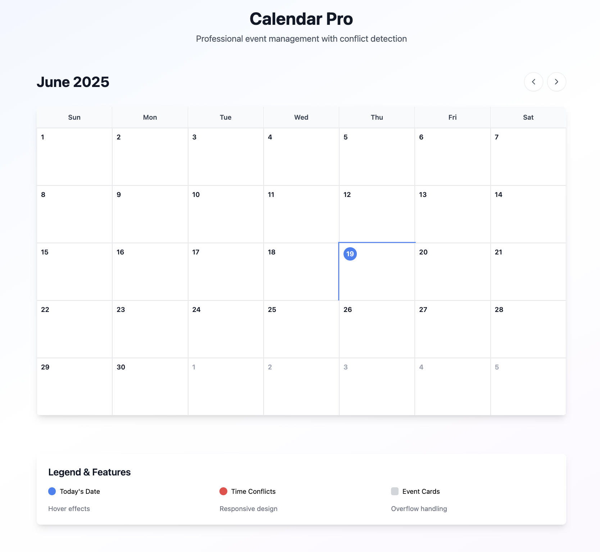

# 📅 Calendar Pro

## 🌐 Live Demo
[calendar-pro-virid.vercel.app](https://calendar-pro-virid.vercel.app)

---

A modern calendar web app built with **React**, **TypeScript**, **Vite**, and **TailwindCSS**, featuring:

- Month navigation
- Event display and scheduling
- Visual conflict detection
- Clean and responsive UI

---

## 🚀 Features

✅ Highlight current day  
✅ Navigate between months  
✅ Load events from static JSON  
✅ Conflict detection with visual indicators  
✅ Responsive design with smooth hover effects  
✅ Built with modular, clean, reusable React components

---

## 🛠️ Tech Stack

- ⚛️ React 18
- 📘 TypeScript
- ⚡ Vite
- 💨 Tailwind CSS
- 📅 date-fns
- 🎯 ESLint + Type Checking

---

## 📷 Screenshot



---

## 📦 Setup Instructions

```bash
# Clone the repo
git clone https://github.com/shalininukella/calendar-pro.git
cd calendar-pro

# Install dependencies
npm install

# Start the development server
npm run dev

📁 Project Structure

project-root/
├── components/         # Calendar components (Day, Header, Grid, EventCard)
├── utils/              # Utility functions for dates and event logic
├── types/              # TypeScript type definitions
├── public/             # Static assets (e.g., events.json)
├── App.tsx             # Root component
├── index.html          # HTML entry
└── main.tsx            # React entry point


🧪 Sample Events Format
json

[
  {
    "startTime": "00:00",
    "endTime": "01:30",
    "color": "#f6be23",
    "title": "Daily Standup",
    "date": "2025-06-20"
  },
  {
    "startTime": "04:30",
    "endTime": "07:30",
    "color": "#f6501e",
    "title": "Weekly Catchup",
    "date": "2025-06-20"
  }
]


👩‍💻 Author
Made with ❤️ by Shalini Nukella

📄 License
This project is licensed under the ISC License.